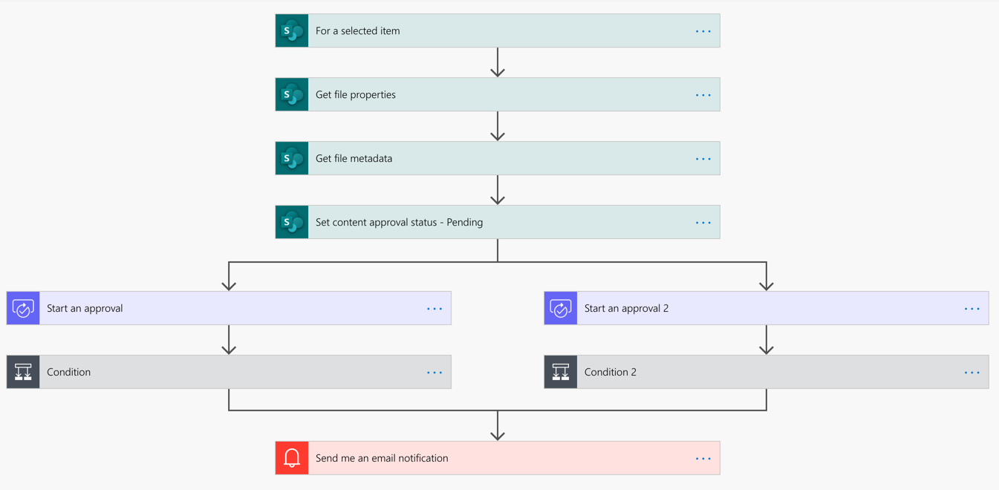

# Customize SharePoint page approvals to meet your needs

With the help of flows in Power Automate, you can configure page approval to add to the standard publishing process for a site. The default publishing flow meets your basic needs.

However, you can add more processes, or even modify how the approval process works. Because page approvals create a flow, you, as the author of the flow, can modify and add whatever business processes you want.

**Approval flow contents**:

- [Associate multiple approval workflows](#create-more-than-one-approval-flow)
- [Handle news posts](handle-news-posts)
- [Auto approve pages](auto-approve-pages)
- [Parallel approvals](parallel-approvals)

To customize the default page approval flow, for a few scenarios, check out the following video:

> [!VIDEO https://youtu.be/pKrHoG70FrM]

## Create more than one approval flow

As a site owner, you are not limited to just one approval flow. You can create multiple flows so page authors can choose which flow to request approval. For example, you could have a workflow dedicated to a page, and the other one dedicated to news.

This approach is much easier than trying to implement all the logic into one flow.

## Handle news post

With the read-only **Promoted State** property, you can easily check if the page submitted for approval is a news or standard page. For example, this is useful for scenarios where you check or enforce approvals for only news, but not for pages.

## Auto approve pages

Its a flow in Power Automate, so you can easily orchestrate it to auto approve requests. In the following scenario, see how you can easily auto approve a page request if the user is a manager who has direct reports. If you're not a manager, the flow goes through the approval process defined in the flow.

## Parallel approvals

Occasionally, the default approval action may not help in tracking and auditing each approval. Alternatively, you can use parallel approvals, include constraints, or apply other processes. You can track, audit and perform other actions within these parallel branches and check if the approval has been approved or rejected.

To learn more, see [Create parallel approval workflows with Power Automate](https://docs.microsoft.com/power-automate/parallel-modern-approvals).

