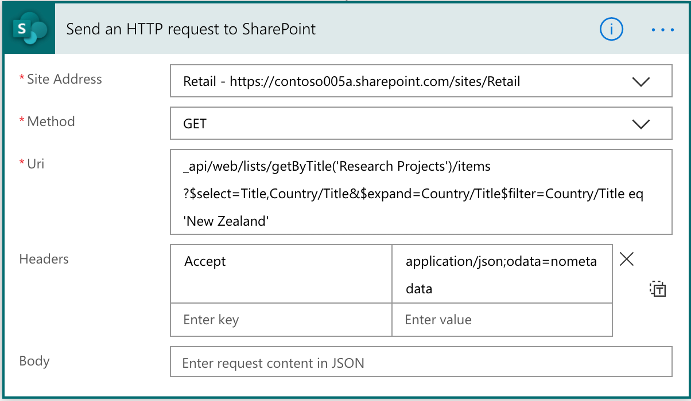

# Working with the SharePoint Send HTTP Request flow action in Power Automate
In Power Automate, the SharePoint Send HTTP Request flow action lets you construct and execute SharePoint REST API queries. This action is particularly useful in cases where the existing SharePoint flow actions do not handle your requirements, or the action you are looking for is not yet available in the SharePoint connector.



To work effectively with the SharePoint Send HTTP Request action, see the following tips.

> [!NOTE]
> This is a developer-focused action. You must understand how SharePoint REST API works and also how to parse JSON strings in Power Automate.

## Get to know the SharePoint REST/OData APIs
SharePoint has many APIs. The focus here is the REST/OData APIs. For the complete set of REST/OData APIs, see [Get to know the SharePoint REST service](/sharepoint/dev/sp-add-ins/get-to-know-the-sharepoint-rest-service#bk_learnmore).

Although, in some cases, you can use the SharePoint 2010 REST APIs *(_vti_bin/listdata.svc)*, we recommend using REST/OData APIs instead.

## Use JSON light
SharePoint REST/OData APIs support [JSON light](https://www.microsoft.com/microsoft-365/blog/2014/08/13/json-light-support-rest-sharepoint-api-released/). This means that you can set headers in your API request that inform SharePoint whether to include any metadata in the response. In many cases, you do not require the metadata. Metadata makes things simpler to parse the output of the action.

To do this, just add the following header:

```http
Accept: application/json; odata=nometadata
```

## Parse the response
If you execute a GET request, you generally want to parse the response. The default response is JSON, making execution simpler.

Parse the response by querying the body of the action, and then parsing through the JSON array or object depending on your response.

To do that, build an expression:

```http
body('Send_an_HTTP_request_to_SharePoint' )['Id']
```

In cases where you have an array, you have a JSON array object. You can use the previous expression and then construct an apply to each action, and use the following expression to input the variable to work with:

```http
body('Send_an_HTTP_request_to_SharePoint' )['value']
```

Inside the apply to each action, you can then access the individual elements with the following expression:

```http
items('Apply_to_each')['Title']
```
