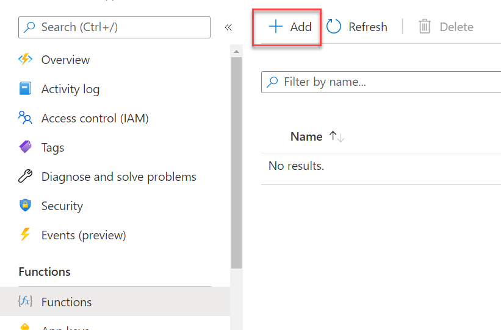
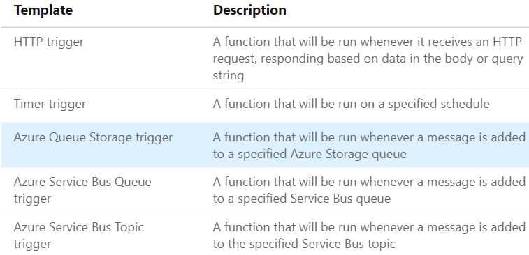

# Calling the PnP provisioning engine from a site script

> [!NOTE]
> This article uses the newest version of PnP PowerShell that is released in January 2021. As Azure Functions run PowerShell Core, you'll have to use this version of PnP PowerShell in your Azure Function. For more information about this version of PnP PowerShell see https://pnp.github.io/powershell.

Site designs offer a great way to standardize the look and feel of your site collections. However, you can't do some things with site designs, like add a footer to every page. You can use the PnP provisioning engine to create a template that you can use to provision an Application Customizer to a site. This Application Customizer can then update your page design, for example to register a footer on every page.

This article describes how to create a site design that applies a PnP provisioning template to a site. The template will add an Application Customizer to render a footer.

The steps in this article use the following components:

- A site design and a site script
- Power Automate
- Azure Queue storage
- Azure Functions
- A SharePoint Framework (SPFx) solution
- A PnP site template
- A PnP PowerShell script
- An Azure AD App Registration

You'll use these components to trigger the PnP provisioning code after you create the site and apply the site design.

[!INCLUDE [pnp-provisioning-engine](../../includes/snippets/open-source/pnp-provisioning-engine.md)]

## Set up app-only access to your tenant

We are going to use authentication with a clientid and a certificate in this tutorial.

1. Create a new self-signed certificate with PnP PowerShell on your computer:

    ```powershell
    Register-PnPAzureADApp -ApplicationName "PnPFlowDemo" -Tenant "contoso.onmicrosoft.com" -DeviceLogin -Out .
    ```

    Replace **contoso.onmicrosoft.com** with your tenant.

    Follow the steps carefully.

    As a result of the command a new Azure AD Application will be registered, permissions will be set correctly, and you will have provided consent to use this application in your tenant. Notice that you require write access to the Azure AD for this.

1. Copy the values the cmdlet returns as you will need the pfx file and the AzureAppId value later.

## Create the Azure Queue storage

In this section, you will use Azure Queue storage to receive messages from Power Automate. Every time a message shows up in the Queue storage, an Azure function is triggered to run a PowerShell script.

To set up the Azure Queue storage:

1. Go to the [Azure portal](https://portal.azure.com) and sign in.
1. Choose **+ Create a resource**.
1. From the Azure Marketplace listings, select **Storage**, and in the Featured column, choose **Storage account - blob, file, table, queue**.
1. Provide values for the required fields. Select **Pin to dashboard**, and choose **Create**. It can take a few minutes for the storage account to be created.
1. Open the storage account and go to **Queues**.
1. Choose **+ Queue** at the top of the screen.
1. Enter **pnpprovisioningqueue** for the name, or enter your own value; be sure to follow the naming standard. Make note of the queue name; you will need this value when you create the Azure Function.
1. Go to **Access Keys** and note the **Storage Account Name** and the **key1 Key value**. You will need these values when you create the flow.

## Create the flow

To put a message in the queue, you need to create a flow.

1. Go to the [Power Automate](https://flow.microsoft.com) site, sign in, and choose **Create from Blank** at the top of the page.
1. Choose **Search hundreds of connectors and triggers** to select your trigger.
1. Search for **Request**, and select **Request - When a HTTP Request is received**.
1. Enter the following JSON as your request body:

    ```json
    {
        "type": "object",
        "properties": {
            "webUrl": {
                "type": "string"
            },
            "parameters": {
                "type": "object",
                "properties": {
                    "event": {
                        "type": "string"
                    },
                    "product": {
                        "type": "string"
                    }
                }
            }
        }
    }
    ```

1. Select **+ New Step** and choose **Add an action**.
1. Search for **Azure Queues** and select **Azure Queues - Put a message on a queue**.
1. Enter a descriptive name for the connection.
1. Enter the storage account name that you copied in the previous section.
1. Enter the storage shared key, which is the value of the **Key1 key value** field of your storage account.
1. Choose **Create**.
1. Select **pnpprovisioningqueue** for the queue name.
1. In the request body, you specified an incoming parameter called *webUrl*. To put the value of that field in the queue, click in the **message** field and select **webUrl** from the Dynamic Content picker.
1. Choose **Save Flow**. This will generate the URL that you will copy in the next step.
1. Choose the first step in your flow ('When an HTTP request is received') and copy the URL.
1. Save your flow.

Your flow should look like the following:


## Test the flow

To test your flow, you have to make a POST request. You can do this via PowerShell, as shown in the following example.

```powershell
$uri = "[the URI you copied in step 14 when creating the flow]"
$body = "{webUrl:'somesiteurl'}"
Invoke-RestMethod -Uri $uri -Method Post -ContentType "application/json" -Body $body
```

When you go to the main screen of your flow, you'll see a run history. If your flow worked correctly, it will show `Succeeded`.
Now go to the queue you just created in Azure and choose **Refresh**. You should see an entry that shows that you correctly invoked the flow.

## Provision the SPFx solution

In this section, you'll use an existing SPFx solution, the [Regions Footer Application Customizer](https://github.com/SharePoint/sp-dev-fx-extensions/tree/master/samples/react-application-regions-footer). Follow the steps in the [Readme](https://github.com/SharePoint/sp-dev-fx-extensions/blob/master/samples/react-application-regions-footer/README.md) file in the sample repo to build and provision the solution.

## Create a PnP provisioning template

Copy the following provisioning template XML to a new file and save the file as FlowDemoTemplate.xml.

```xml
<?xml version="1.0"?>
<pnp:Provisioning xmlns:pnp="http://schemas.dev.office.com/PnP/2017/05/ProvisioningSchema">
  <pnp:Preferences Generator="OfficeDevPnP.Core, Version=2.20.1711.0, Culture=neutral, PublicKeyToken=3751622786b357c2" />
  <pnp:Templates ID="CONTAINER-FLOWDEMO">
    <pnp:ProvisioningTemplate ID="TEMPLATE-FLOWDEMO" Version="1" BaseSiteTemplate="GROUP#0" Scope="RootSite">
      <pnp:CustomActions>
        <pnp:WebCustomActions>
          <pnp:CustomAction Name="spfx-react-app-customizer" Description="Custom action for Application Customizer" Location="ClientSideExtension.ApplicationCustomizer" Title="spfx-react-app-customizer" Sequence="0" Rights="" RegistrationType="None" ClientSideComponentId="67fd1d01-84e8-4fbf-85bd-4b80768c6080" ClientSideComponentProperties="{&quot;SourceTermSetName&quot;:&quot;Regions&quot;}" />
        </pnp:WebCustomActions>
      </pnp:CustomActions>
    </pnp:ProvisioningTemplate>
  </pnp:Templates>
</pnp:Provisioning>
```

> [!NOTE]
> The provisioning template adds a custom action to a solution. The **ClientSideComponentId** is associated with the [Regions Footer Application Customizer](https://github.com/SharePoint/sp-dev-fx-extensions/tree/master/samples/react-application-regions-footer) that you provisioned earlier. If you run this demo with your own SPFx solution, change the **ClientSideComponentId** and optionally the **ClientSideComponentProperties** attribute values in the XML.

## Create the Azure Function

1. Go to the [Azure Portal](https://portal.azure.com).
1. Choose **+ Create a resource**.
1. Search for **Function App** and create a new function app. In the **Storage** field, select **Use existing**, and select the storage account that you created earlier. Set the other values as required, but make sure to select **PowerShell Core** as the **Runtime** and select **7.0** as the **Version**

    

1. When created, navigate to your new Function App
1. Select **App Files**

    

1. In the dropdown menu, select **requirements.psd1** and add a new entry as follows

    ```powershell
    # This file enables modules to be automatically managed by the Functions service.
    # See https://aka.ms/functionsmanageddependency for additional information.
    #
    @{
        # For latest supported version, go to 'https://www.powershellgallery.com/packages/Az'.
        'Az' = '5.*'
        # For the latest supported version, go to 'https://www.powershellgallery.com/packages/PnP.PowerShell'.
        'PnP.PowerShell' = '1.*'
    }
    ```

    Save the file. Notice, that if you do no intent to use the Azure PowerShell Cmdlets you can remove that entry from this file. The requirements.psd1 file makes sure that specific PowerShell modules will be available to all functions. At the first execution of the Azure Function these modules will be downloaded and made available. You can also use wildcard references for the version. See for more information about this file here: https://docs.microsoft.com/azure/azure-functions/functions-reference-powershell?tabs=portal#dependency-management

1. Create a new Azure Function **Functions** > **Add**:

    

1. Create a new Azure Store Queue Trigger function:

    

1. Name the function **InvokePnPSiteTemplate**.
1. Enter the name of the queue you created earlier.
1. Choose **Add**. A new page opens where you can modify the function.

> [!NOTE]
> The Storage account must be in the same region as of Azure Function App, because the resources that talk to one another should be co-located in the same region. This is a requirement for Azure Functions.


## Finish the Azure Function

1. Go to the Function App main screen and select **Advanced Tools** in the left menu and click **Go**. A new tab will open.
1. Select **PowerShell** from the **Debug Console** menu at the top.
1. Navigate to **site\wwwroot\InvokePnPSiteTemplate** (or **site\wwwroot\[name of your function]**)
1. Drag and drop the earlier created **FlowDemoTemplate.xml** file onto the page. This will upload the file to the folder.
1. Drag and drop the earlier generated **cert.pfx** file onto the page. This will upload the file to the folder.
1. Navigate back to the function and select **Code + Test** to edit the function.
1. Replace the PowerShell script with the following:

    ```powershell
    param([string] $QueueItem, $TriggerMetadata)

    # Write out the queue message and insertion time to the information log.
    Write-Host "PowerShell queue trigger function processed work item: $QueueItem"
    Write-Host "Queue item insertion time: $($TriggerMetadata.InsertionTime)"
    Connect-PnPOnline -ClientId [insertyourAzureAppIdhere] -CertificatePath D:\home\site\wwwroot\InvokePnPSiteTemplate\cert.pfx -Tenant 'contoso.onmicrosoft.com' -Url $QueueItem
    Write-Output "Connected to site"
    Invoke-PnPSiteTemplate -Path D:\home\site\wwwroot\InvokePnPSiteTemplate\FlowDemoTemplate.xml
    ```

    Replace **[insertyourAppIdHere]** with the value that the `Register-PnPAzureApp` cmdlet returned for AzureAppId.
    
    Replace **'contoso.onmicrosoft.com'** with your tenant details.

## Create the site design

Open PowerShell and connect to your tenant using **Connect-PnPOnline**.

```powershell
Connect-PnPOnline -Url https://[yourtenant]-admin.sharepoint.com
```

Now you can get the existing site designs.

```powershell
Get-PnPSiteDesign
```

To create a site design, you first need to create a site script. A site design is a container that refers to one or more site scripts.

1. Copy the following JSON code to your clipboard and modify it. Set the **url** property to the value you copied when you created the flow. The URL looks similar to the following:

    `https://prod-27.westus.logic.azure.com:443/workflows/ef7434cf0d704dd48ef5fb6...oke?api-version=2016-06-01&sp=%2Ftriggers%2Fmanual%2Frun`

    ```json
    {
        "$schema": "schema.json",
        "actions": [
        {
                "verb": "triggerFlow",
                "url": "[paste the workflow trigger URL here]",
                "name": "Apply Template",
                "parameters": {
                    "event":"",
                    "product":""
                }
        }
        ],
        "bindata": {},
        "version": 1
    }
    ```

1. Select the JSON again and copy it again to your clipboard.
1. Open PowerShell and enter the following to copy the script into a variable and create the site script:

    ```powershell
    $script = Get-Clipboard -Raw
    Add-PnPSiteScript -Title "Apply PnP Site Template" -Content $script
    Get-PnPSiteScript
    ```

1. You will see a list of one or more site scripts, including the site script you just created. Select the ID of the site script that you created and copy it to the clipboard.
1. Use the following command to create the site design:

    ```powershell
    Add-PnPSiteDesign -Title "Site with footer" -SiteScriptIds [Paste the ID of the Site Script here] -WebTemplate TeamSite
    ```

## Verify the results

After you created your Azure Queue storage, you created the app ID for app-only access, the Azure Function, and the site design. You then triggered the Power Automate flow from the site design.

To test the results, create a new site. In your SharePoint tenant, select **SharePoint** > **Create Site** > **Team Site**. Your new site design should show up as a design option. Notice that the site design is applied after the site is created. If you configured it correctly, your flow will be triggered. You can check the run history of the flow to verify that it ran correctly. Note that the footer might not show up immediately; if you don't see it, wait a minute and reload your site to check again.
