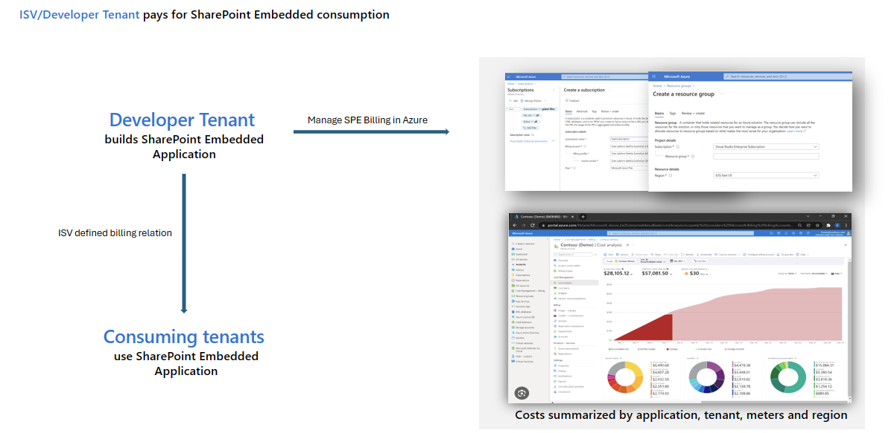
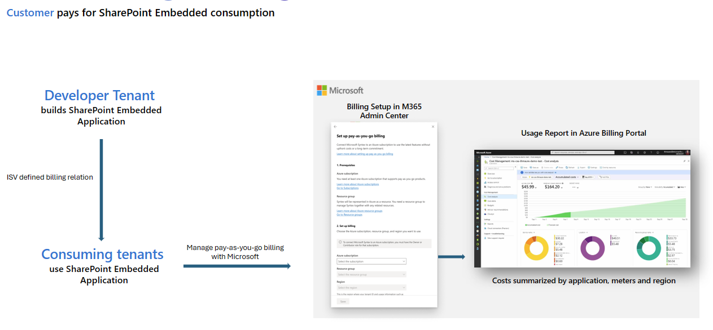

# SharePoint Embedded billing

SharePoint Embedded is a consumption-based Pay-as-you-go (PAYG) offering meaning you pay only for what you use. SharePoint Embedded provides two billing models which the tenant developing the SharePoint Embedded application can select for respective container types, tailoring it to their unique business requirements. The two billing models are

### Standard

With the standard billing model, all consumption-based charges are directly billed to the tenant that owns/develops the application. The admin in the developer tenant  must establish a valid billing profile when creating a standard container type.



### Pass-through

With pass-through billing, consumption-based charges are billed directly to the tenant registered to use the SharePoint Embedded application. Admins in the developer tenant don't need to set up a billing profile when creating a pass-through SharePoint Embedded container type. Once the container type is registered in the consuming tenant, the consuming tenant admin (SharePoint Admin or Global Admin) needs to set up the billing profile in the consuming tenant to use the SharePoint Embedded application.



## Prerequisites to set up Pay-as-you-go for SharePoint Embedded

To enable PAYG on SharePoint Embedded, you need:

1. Existing SharePoint tenancy
1. An Azure subscription in the tenancy
1. A resource group attached to the Azure subscription

### Roles and Permissions

- Admin who sets up billing relationship for SharePoint Embedded needs to have owner or contributor permissions on Azure subscription.
- Admin needs to have a SharePoint Embedded Administrator or Global Admin role to operate billing cmdlets.

## Set up a Standard Billing container type

For standard billed container types, developer admin should set up billing in their tenant. Microsoft 365 SharePoint Embedded Administrator serves as the developer admin. Global Administrators in Microsoft 365 can assign users the SharePoint Embedded Administrator. The Global Administrator role already has all the permissions of the SharePoint Embedded Administrator role. The SharePoint Embedded Admin role is available in Microsoft Entra and Microsoft 365 Admin Center.

Here are the step-by-step instructions on how to create a standard billing container:

1. Download and install the [latest version of SharePoint Online Management Shell](https://www.microsoft.com/download/details.aspx?id=35588)
1. Open SharePoint Online Management Shell from **Start** screen, type **sharepoint**, and then select **SharePoint Online Management Shell**.
1. Connect to SPO service using `Connect-SPOService` cmdlet by providing admin credentials associated with tenancy. For information on [how to use Connect-SPOService](/powershell/module/sharepoint-online/connect-sposervice), refer the linked documentation.
1. Create container type using `New-SPOContainerType` cmdlet by providing an **azure subscription**, **resource group** associated with the subscription and a **region**.

    1. If you don't have an Azure subscription, you can create on by following steps here to [create an Azure subscription in your tenancy](/azure/cloud-adoption-framework/ready/azure-best-practices/initial-subscriptions)
    1. If you don't have a resource group, you can create on by following steps here to [create a resource group](/azure/azure-resource-manager/management/manage-resource-groups-portal)

```powershell
New-SPOContainerType -ContainerTypeName <ContainerTypeName>
                     -OwningApplicationId <OwningApplicationId>
                     -AzureSubscriptionId <AzureSubscriptionId>
                     -ResourceGroup <ResourceGroup>
                     -Region <Region>
```

> [!IMPORTANT]
> Every container type must have an owning application.
>
> A single owning app can only own one container type at a time.
>
> An Azure subscription can be attached to any number of container types.

### View & Edit billing properties of Standard container type

You can view properties of a container type and associated billing properties by using one of the two PowerShell cmdlets:

1. See all container types and billing properties except associated region:

    ```powershell
    Get-SPOContainerType
    ```

1. See billing properties associated with a container type including region:

    ```powershell
    Get-SPOContainerType -ContainerTypeId <ContainerTypeId>
    ```

1. Update Azure subscription or resource group associated with a container type:

    ```powershell
    Set-SPOContainerType -ContainerTypeId <ContainerTypeId> [-AzureSubscriptionId <AzureSubscriptionId>] [-ResourceGroup <ResourceGroup>]
    ```

## SharePoint Embedded meters

Refer to the [SharePoint Embedded meters](meters.md) article to learn more about the pay-as-you-go meters supported.
