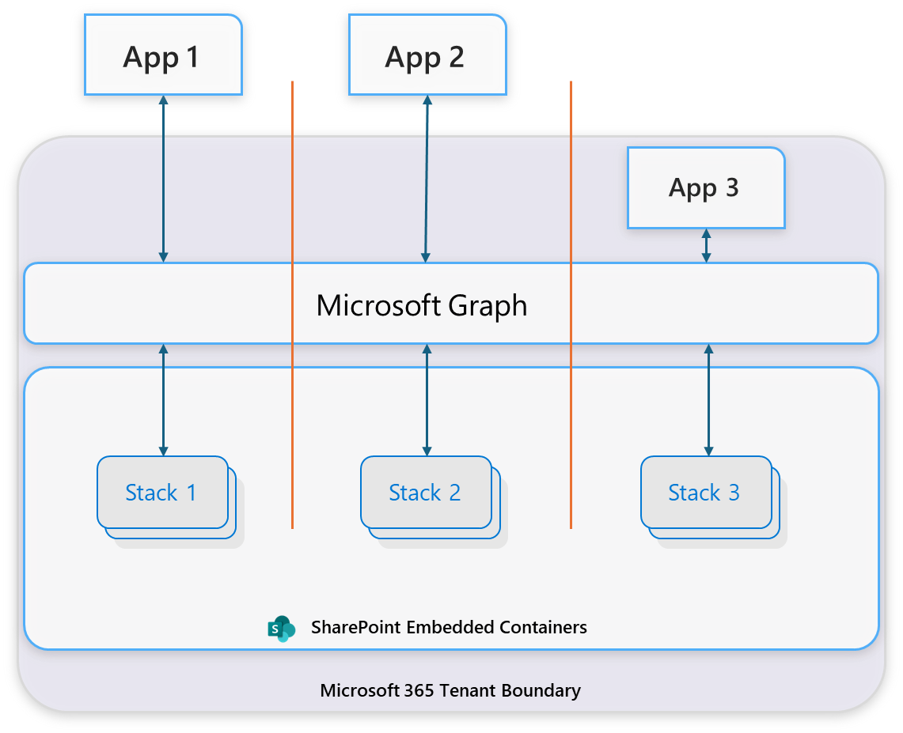
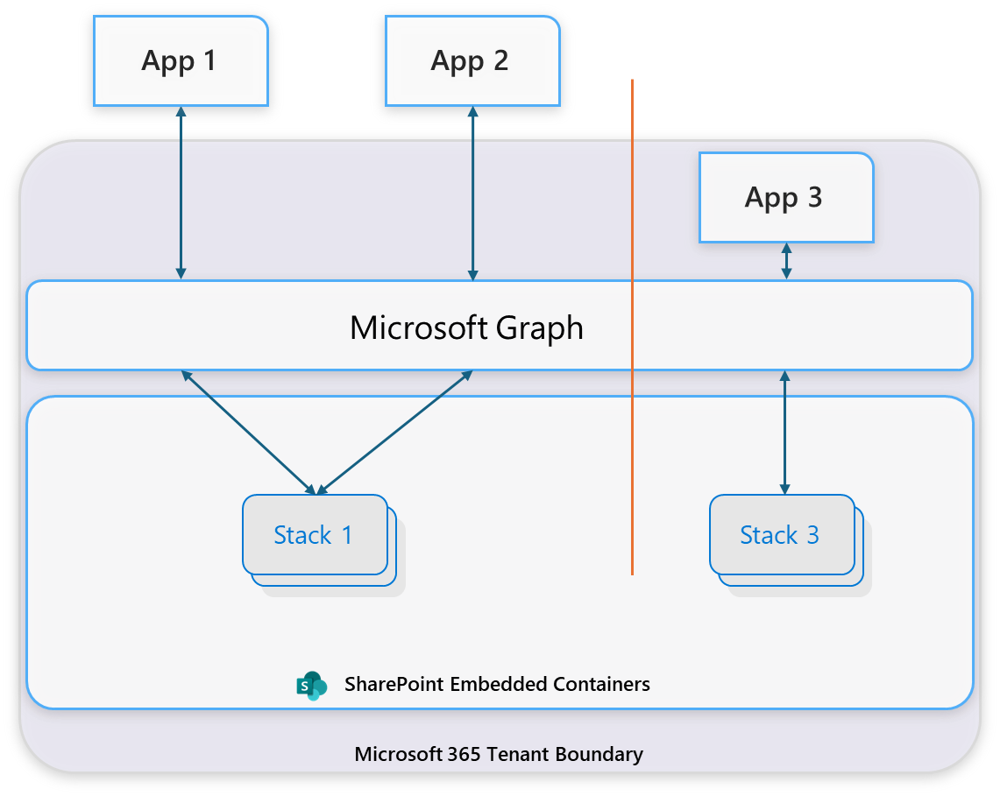

# SharePoint Embedded app architecture

All files and documents in SharePoint Embedded are stored in containers, with all containers and container content created and stored within a Microsoft 365 Tenant. All containers and container content are created, managed, and interacted via the SharePoint Embedded application using Microsoft Graph. 

## SharePoint Embedded application

A Microsoft Entra ID application registration. As an owning or guest application to a container type, it has access to containers of that container type.  

## Owning tenant and consuming tenant

SharePoint Embedded introduces the concepts of owning tenant and consuming tenant. Owning tenant is a Microsoft Entra ID tenant where a container type is created. This is often also the tenant where your SharePoint Embedded application is registered. Consuming tenant is a Microsoft Entra ID tenant where a container type is used. Only a consuming tenant may have containers of such container type. All container and content created via the application is stored within the consuming tenant's Microsoft 365 tenant boundary. 

The same Microsoft Entra ID tenant can be both owning and consuming tenant of a given container type in the SharePoint Embedded ecosystem. 

## Container, container type, and owning application

A container is the basic storage unit in SharePoint Embedded. Also, a container defines a security and compliance boundary.

A container type is a SharePoint Embedded resource that defines the relationship, access privileges, and billing accountability between an application and a set of containers. Also, the container type defines behaviors on the set of containers. Learn more about [container types](../app-concepts/).

The container type is represented on each container as an immutable property and is used across the entire SharePoint Embedded ecosystem. Each container type is strongly coupled with one SharePoint Embedded application, which is referred to as the owning application. The owning application developer (the owning tenant) is responsible for creating and managing their container types. SharePoint Embedded mandates a 1:1 relationship between owning application and container type.

## Access Model

An application's access to containers and container content is determined by a set of permissions configured between the application and the container type it attempts to access. This set of permission is determined at container Type creation time for owning application. The SharePoint Embedded ecosystem allows applications to access containers of container types it doesn't own.

In this illustration, multiple applications are deployed in the tenancy, including two apps developed by ISVs (App 1 and 2) and a LOB app (App 3). Each application can access only to the stack of containers of the container type they own. 

In this illustration, both App 1 and App 2 in the tenancy have access to the same container type. Both apps can access the stack of the containers of that type.

#### Example

Contoso is an ISV and built a human resource management application on SharePoint Embedded. The application is registered and deployed in Fabrikam, an auditing firm. Fabrikam also developed an LOB auditing application on SharePoint Embedded that is used internally.

In this scenario, both the human resource management application developed by Contoso and the auditing application developed by Fabrikam have their own container type. Contoso is the owning tenant of the human resource management application; and the application is the owning app for its container Type. Likewise, Fabrikam is the owning tenant the auditing application; and the application is the owning app for its container type. In addition, Fabrikam is the consuming tenant for both applications. 

