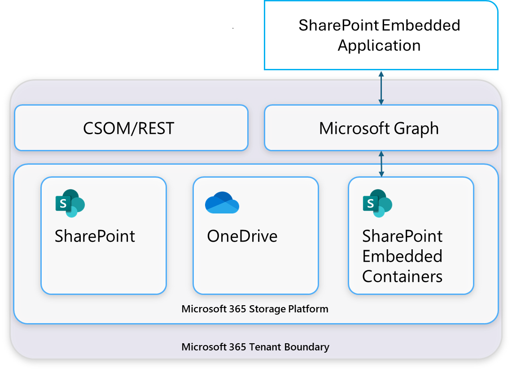

# SharePoint Embedded App Architecture

All files and documents in SharePoint Embedded (SPE) are stored in containers, with all containers and container content created and stored within a Microsoft 365 Tenant. All containers and container content are created, managed and interacted via the SPE application using Microsoft Graph. 

## Owning Tenant and Consuming Tenant
SPE introduces the concepts of owning tenant and consuming tenant. Owning tenant develops and owns their SPE application and is the owner of the corresponding container type for the app. Consuming tenant is the tenant where the SPE application is registered and deployed. All container and content created via the SPE application is stored within the cosnuming tenant's M365 tenant boundary. 

A tenant can be both the owning and consuming tenant in the SPE ecosystem. For example, an orgranization can build thier own line of business application with SPE. 

## Container Type and Owning Application

A container type is a SharePoint Embedded resource that defines the relationship, access privileges, and billing accountability between a SharePoint Embedded application and a set of containers. Also, the container type defines behaviors on the set of containers. Learn more about [container types](./containertypes.md).

Container type is represented on each container as an immutable property and is used across the entire SharePoint Embedded ecosystem. Each container type is strongly coupled with one SharePoint Embedded application, which is referred to as the owning application. The owning application developer (the owning tenant) is responsible for creating and managing their container types. SharePoint Embedded mandates a 1:1 relationship between owning application and container type.

## Access Model
An SPE application's access to containers and container content is determined by a set of permissions configured between the application and the container type it attempts to access. This set of permission is determined at container type creation time for owning application. The SPE ecosystem allows SPE applications to access containers of container types it does not own.

In this illustration, multiple SPE applications are deployed in the tenancy, including two apps developed by ISVs (App 1 and 2) and a LOB app (App 3). Each application can access only to the stack of containers of the container type they own. 

In this illustration, both App 1 and App 2 in the tenancy have access to the same container type. Both apps can access the stack of the containers of that type.

#### Example
Contoso is an ISV and built an human resource management application on SPE. The application is registered and deployed in Fabrikam, an auditing firm. Fabrikam also developed an LOB auditing appliction on SPE that is used internally.

In this scenario, both the human resource management application developed by Contoso and the auditing application developed by Fabrikam have their own container type. Contoso is the owning tenant of the human resource management application; and the application is the owning app for its container type. Likewise, Fabrikam is the owning tenant the auditing application; and the application is the owning app for its container type. In addition, Fabrikam is the consuming tenant for both applications. 

