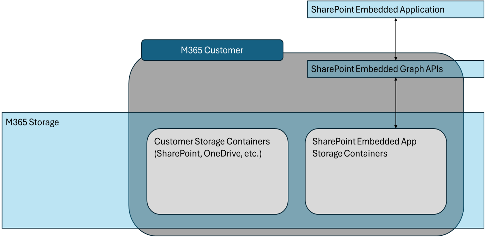

# SharePoint Embedded App Architecture

### Anatomy of a SharePoint Embedded application 

All files and documents in SharePoint Embedded are stored in Containers. All Containers are created and stored within an M365 Tenant. The ISV or LOB app then uses the Microsoft Graph API to interact with the dedicated container(s) for that app. The containers are part of the M365 customer’s tenant regardless of how the app is deployed.

<!--  -->

**Container Relationship**

- Every container type is owned by one SharePoint Embedded Application
- Only the app owning a container type may create instances of a container.
- Container instances must belong to a container type.
- An app may instantiate zero or more container instances for a given container type.
- Apps can grant permission to other apps to create, read, update, and/or delete container instances of container types of the owning app , e.g. to allow backup/restore or DLP apps to operate on content in those containers and/or create instances of the container type. Note, the owning application is charged for storage in all instances of a container type regardless of which app originally instantiated the container.

### **SharePoint Embedded Containers and Container Types**
SharePoint Embedded Containers (container) are the basic unit of storage on the SharePoint Embedded platform; every SharePoint Embedded Container is created and stored in an M365 Tenant. SharePoint Embedded Containers are similar to Drives in Microsoft Graph. Files and documents stored in Containers/Drives can be referenced as Drive Items.

When a Container is created, it must have a specific ContainerType. ContainerTypes define the permissions and controls and manage access for all containers of that type. This includes read/write access to various containers. See a more detailed explanation of Container Types in the section below.

A Container Type is a SharePoint Embedded-container level property stamped on every instance of SharePoint Embedded containers. Its primary function is to identify the application workloads that can access a container instance.

In the Microsoft ecosystem, each application needs to be registered with Azure AD to obtain a unique Azure ID (referred here as AppID or ClientID). This rule applies to all variants of the same app. For example, if a developer launches an application on the Web, iOS, and Android, that developer would register these variants as three separate apps on Azure. This will generate three AppIDs. The same containers can be accessed by all three apps.

#### More on SharePoint Embedded Container Types
Container Types are the way SharePoint Embedded supports this relationship and authorizes requests:

1) Each container instance is associated to one immutable container type; and 2) each container type is associated to at least one AppID and a set of container operations on SharePoint Embedded (permission mapping). The permission mapping determines the operations an application has permission to invoke against all container instances of a specific type.

- Each container instance is tied to one and only one container type. Container types are immutable.
- Each container type is tied to at least one application. Association between container type and application can be changed
- Each container type and application pairing are mapped to a set of permissions. This set of permissions determines the operations an application can invoke against all container instances of that container type.
- A SharePoint Embedded application can only access containers it is authorized to access.

<!--  -->

  

## Terms and Definitions 
**Application Workload:** The collection of applications that have access to a container type

**Consuming Tenant:** The tenant in which the SharePoint Embedded Application has been registered and will execute in. 

**Container Type:** A property of containers that uniquely identifies the SharePoint Embedded application workload the Container is associated with.

**Container Type Permissions:** Container Type level configuration describing permissions that SharePoint Embedded applications have to Container instances of a Container Type. The Owning SharePoint Embedded Application manages the Container Type Permissions. 

**ContainerTypeID:** A GUID specifying which workload owns the container. For example, the Owning Tenant would generate a ContainerTypeID that is stamped on each of their containers. 

**Drive:** SharePoint Embedded Containers are considered Drives in Graph. Container IDs and Drive IDs are synonymous. 

**Drive Item:** Any file or folder stored in Drives or Containers are called DriveItems. Containers hold DriveItems.

**Owning SharePoint Embedded Application:** The SharePoint Embedded Application that was used to originally register the Container Type. 

**Owning Tenant:** The tenant that developed the SharePoint Embedded Application. This is also the tenant that will be invoiced for any instances and usage of Storage Containers of the Container Type that they own. For example, a company Contoso develops a SharePoint Embedded application that Fabrikam has registered to run. In this case, Contoso is the owning tenant and Fabrikam is the consuming tenant.

**SharePoint Embedded Application:** An application that leverages Storage Containers for storing content.  

**SharePoint Embedded Developer:** The application developer who built the SharePoint Embedded Application.  

**SharePoint Embedded Storage Container (“Container”):** A storage container is the top-level container in SharePoint Embedded. A StorageContainer holds content in the form of Drive and DriveItems.  
