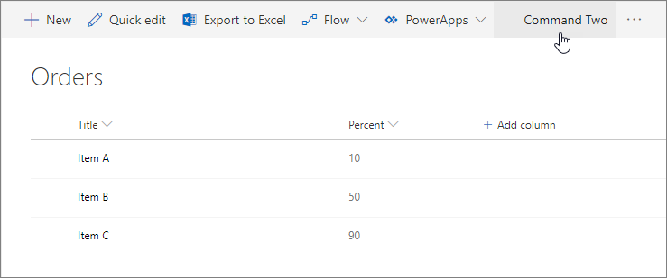
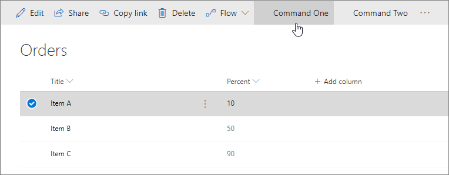
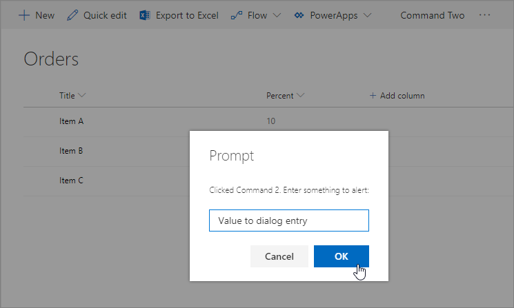
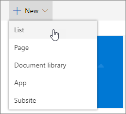

# Build your first ListView Command Set extension

Extensions are client-side components that run inside the context of a SharePoint page. Extensions can be deployed to SharePoint Online, and you can use modern JavaScript tools and libraries to build them.

You can follow these steps by watching the video on the SharePoint PnP YouTube Channel:

<br/>

> [!Video https://www.youtube.com/embed/AiQ2d1bpARA]

<br/> 

## Create an extension project

1. Create a new project directory in your favorite location.

    ```shell
    md command-extension
    ```

1. Go to the project directory.

    ```shell
    cd command-extension
    ```

1. Create a new HelloWorld extension by running the Yeoman SharePoint Generator.

    ```shell
    yo @microsoft/sharepoint
    ```

1. When prompted:

    * Accept the default value of **command-extension** as your solution name, and then select Enter.
    * Select **SharePoint Online only (latest)**, and select Enter.
    * Select **Use the current folder**, and select Enter.
    * Select **N** to allow solution to be deployed to all sites immediately.
    * Select **N** on the question if solution contains unique permissions.
    * Select **Extension** as the client-side component type to be created.
    * Select **ListView Command Set** as the extension type to be created.

1. The next set of prompts ask for specific information about your extension:

    * Accept the default value of **HelloWorld** as your extension name, and then select Enter.
    * Accept the default value of **HelloWorld description** as your extension description, and select Enter.

    

    At this point, Yeoman installs the required dependencies and scaffolds the solution files along with the **HelloWorld** extension. This might take a few minutes.

    When the scaffold is complete, you should see the following message indicating a successful scaffold:

    

    For information about troubleshooting any errors, see [Known issues](../../known-issues-and-common-questions.md).

1. Next, type the following into the console to start Visual Studio Code.

    ```shell
    code .
    ```

    > [!NOTE]
    > Because the SharePoint client-side solution is HTML/TypeScript based, you can use any code editor that supports client-side development to build your extension.

    Note how the default solution structure looks like the solution structure of client-side web parts. This is the basic SharePoint Framework solution structure, with similar configuration options across all solution types.

    

1. Open **HelloWorldCommandSet.manifest.json** in the **src\extensions\helloWorld** folder.

    This file defines your extension type and a unique identifier `id` for your extension. You need this unique identifier later when debugging and deploying your extension to SharePoint.

    Note the actual command definitions in the manifest file. These are the actual buttons that are exposed based on the registration target. In the default template, you find two different buttons: **Command One** and **Command Two**.

    

    Currently, images are not properly referenced unless you are referring to them from absolute locations in a CDN within your manifest. This will be improved in future releases.

## Code your ListView Command Set

Open the **HelloWorldCommandSet.ts** file in the **src\extensions\helloWorld** folder.

Notice that the base class for the ListView Command Set is imported from the **sp-listview-extensibility** package, which contains SharePoint Framework code required by the ListView Command Set.

```typescript
import { override } from '@microsoft/decorators';
import { Log } from '@microsoft/sp-core-library';
import {
  BaseListViewCommandSet,
  Command,
  IListViewCommandSetListViewUpdatedParameters,
  IListViewCommandSetExecuteEventParameters
} from '@microsoft/sp-listview-extensibility';
import { Dialog } from '@microsoft/sp-dialog';
```

The behavior for your custom buttons is contained in the **onListViewUpdated()** and **OnExecute()** methods.

The **onListViewUpdated()** event occurs separately for each command (for example, a menu item) whenever a change happens in the ListView, and the UI needs to be re-rendered. The `event` function parameter represents information about the command being rendered. The handler can use this information to customize the title or adjust the visibility, for example, if a command should only be shown when a certain number of items are selected in the list view. This is the default implementation.

When using the method `tryGetCommand`, you get a Command object, which is a representation of the command that shows in the UI. You can modify its values, such as `title`, or `visible`, to modify the UI element. SPFx uses this information when re-rendering the commands. These objects keep the state from the last render, so if a command is set to `visible = false`, it remains invisible until it is set back to `visible = true`.

```typescript
  @override
  public onListViewUpdated(event: IListViewCommandSetListViewUpdatedParameters): void {
    const compareOneCommand: Command = this.tryGetCommand('COMMAND_1');
    if (compareOneCommand) {
      // This command should be hidden unless exactly one row is selected.
      compareOneCommand.visible = event.selectedRows.length === 1;
    }
  }
```

The **OnExecute()** method defines what happens when a command is executed (for example, the menu item is selected). In the default implementation, different messages are shown based on which button was selected.

```typescript
@override
public onExecute(event: IListViewCommandSetExecuteEventParameters): void {
  switch (event.itemId) {
    case 'COMMAND_1':
      Dialog.alert(`${this.properties.sampleTextOne}`);
      break;
    case 'COMMAND_2':
      Dialog.alert(`${this.properties.sampleTextTwo}`);
      break;
    default:
      throw new Error('Unknown command');
  }
}
```

## Debug your ListView Command Set

You cannot currently use the local Workbench to test SharePoint Framework Extensions. You'll need to test and develop them directly against a live SharePoint Online site. You don't have to deploy your customization to the app catalog to do this, which makes the debugging experience simple and efficient.

1. Go to any SharePoint list in your SharePoint Online site by using the modern experience or create a new list. Copy the URL of the list to clipboard as we will be needing that in following step.

    Because our ListView Command Set is hosted from localhost and is running, we can use specific debug query parameters to execute the code in the list view.

1. Open **serve.json** file from **config** folder. Update the **pageUrl** attributes to match a URL of the list where you want to test the solution. After edits your serve.json should look somewhat like:

    ```json
    {
      "$schema": "https://developer.microsoft.com/json-schemas/core-build/serve.schema.json",
      "port": 4321,
      "https": true,
      "serveConfigurations": {
        "default": {
          "pageUrl": "https://sppnp.sharepoint.com/sites/Group/Lists/Orders/AllItems.aspx",
          "customActions": {
            "bf232d1d-279c-465e-a6e4-359cb4957377": {
              "location": "ClientSideExtension.ListViewCommandSet.CommandBar",
              "properties": {
                "sampleTextOne": "One item is selected in the list",
                "sampleTextTwo": "This command is always visible."
              }
            }
          }
        },
        "helloWorld": {
          "pageUrl": "https://sppnp.sharepoint.com/sites/Group/Lists/Orders/AllItems.aspx",
          "customActions": {
            "bf232d1d-279c-465e-a6e4-359cb4957377": {
              "location": "ClientSideExtension.ListViewCommandSet.CommandBar",
              "properties": {
                "sampleTextOne": "One item is selected in the list",
                "sampleTextTwo": "This command is always visible."
              }
            }
          }
        }
      }
    }
    ```

1. Compile your code and host the compiled files from the local machine by running this command:

    ```shell
    gulp serve
    ```

    When the code compiles without errors, it serves the resulting manifest from https://localhost:4321.

    This will also start your default browser within the URL defined in **serve.json** file. Notice that at least in Windows, you can control which browser window is used by activating the preferred one before executing this command.

1. Accept the loading of debug manifests by selecting **Load debug scripts** when prompted.

    

1. Notice the new **Command Two** button available in the toolbar. Select that button to see the text provided as property for the `sampleTextTwo` property.

    

1. The **Command One** button is not visible based on the code, until one row is selected in the document library. Upload or create a document to the library and confirm that the second button is visible.

    

1. Select **Command Two** to see how the dialog control works, which is used in the default output from the solution scaffolding when the ListView Command Set is selected as the extension type. 

    

### More details about serve.config options

* **customActions** simulates a custom action. You can set many properties on this `CustomAction` object that affect the look, feel, and location of your button; we’ll cover them all later.
  * **GUID**: GUID of the extension.
  * **Location**: Where the commands are displayed. The possible values are:
    * **ClientSideExtension.ListViewCommandSet.ContextMenu**:  The context menu of the item(s).
    * **ClientSideExtension.ListViewCommandSet.CommandBar**: The top command set menu in a list or library.
    * **ClientSideExtension.ListViewCommandSet**: Both the context menu and the command bar (corresponds to SPUserCustomAction.Location="CommandUI.Ribbon").
  * **Properties**: An optional JSON object containing properties that are available via the `this.properties` member.

<br/>

## Enhance the ListView Command Set rendering

The default solution takes advantage of a new Dialog API, which can be used to show modal dialogs easily from your code. In the following steps, we'll slightly modify the default experience to demonstrate Dialog API use cases.

1. Return to Visual Studio Code (or your preferred editor).
1. Open **HelloWorldCommandSet.ts** from the **src\extensions\helloWorld** folder.
1. Update the **onExecute** method as follows:

    ```typescript
    @override
    public onExecute(event: IListViewCommandSetExecuteEventParameters): void {
      switch (event.itemId) {
        case 'COMMAND_1':
          Dialog.alert(`Clicked ${strings.Command1}`);
          break;
        case 'COMMAND_2':
          Dialog.prompt(`Clicked ${strings.Command2}. Enter something to alert:`).then((value: string) => {
            Dialog.alert(value);
          });
          break;
        default:
          throw new Error('Unknown command');
      }
    }
    ```

1. In your console window, ensure that you do not have any exceptions. If you do not already have the solution running in localhost, execute the following command:

    ```shell
    gulp serve
    ```

1. Accept the loading of debug manifests by selecting **Load debug scripts** when prompted.

    

    We still have the same buttons in the toolbar, but you'll notice they behave differently if you select them one-by-one. Now we are using the new Dialog API, which can be easily used with your solutions, even for complex scenarios. 

    

## Add a ListView Command Set to a solution package for deployment

1. Return to your solution in Visual Studio Code (or to your preferred editor).
1. Extend the **sharepoint** folder and **assets** sub folder in the root of the solution to see the existing **elements.xml** file. 

    

### Review the elements.xml file

Open the **elements.xml** file inside the **sharepoint\assets** folder.

Note the following XML structure in **elements.xml**. The **ClientSideComponentId** property has been automatically updated to the unique ID of your ListView Command Set available in the **HelloWorldCommandSet.manifest.json** file in the **src\extensions\helloWorld** folder.

Notice that we use a specific location value of `ClientSideExtension.ListViewCommandSet.CommandBar` to define that this is a ListView Command Set and it should be displayed in the command bar. We also define the `RegistrationId` as **100** and the `RegistrationType` as **List** to associate this custom action automatically with generic lists. `ClientSideComponentProperties` can be used to provide instance specific configurations. In this case, we are using default properties called *sampleTextOne* and *sampleTextTwo*.

```xml
<?xml version="1.0" encoding="utf-8"?>
<Elements xmlns="http://schemas.microsoft.com/sharepoint/">

    <CustomAction 
        Title="SPFxListViewCommandSet"
        RegistrationId="100"
        RegistrationType="List"
        Location="ClientSideExtension.ListViewCommandSet.CommandBar"
        ClientSideComponentId="5fc73e12-8085-4a4b-8743-f6d02ffe1240"
        ClientSideComponentProperties="{&quot;sampleTextOne&quot;:&quot;One item is selected in the list.&quot;, &quot;sampleTextTwo&quot;:&quot;This command is always visible.&quot;}">
    </CustomAction>

</Elements>
```

> [!NOTE]
> While running from localhost the custom action will work on both lists and document libraries, but will not once deployed unless the `elements.xml` is updated. `RegistrationId=100` will only associate the custom action with lists and **NOT** document libraries. In order to associate the custom action with document libraries, the `RegistrationId` must be set to **101**. If you would like the action to work on both lists and document libraries, another `CustomAction` must be added to the `elements.xml` file

```xml
<?xml version="1.0" encoding="utf-8"?>
<Elements xmlns="http://schemas.microsoft.com/sharepoint/">

    <CustomAction 
        Title="SPFxListViewCommandSet"
        RegistrationId="100"
        RegistrationType="List"
        Location="ClientSideExtension.ListViewCommandSet.CommandBar"
        ClientSideComponentId="5fc73e12-8085-4a4b-8743-f6d02ffe1240"
        ClientSideComponentProperties="{&quot;sampleTextOne&quot;:&quot;One item is selected in the list.&quot;, &quot;sampleTextTwo&quot;:&quot;This command is always visible.&quot;}">
    </CustomAction>

    <CustomAction 
        Title="SPFxListViewCommandSet"
        RegistrationId="101"
        RegistrationType="List"
        Location="ClientSideExtension.ListViewCommandSet.CommandBar"
        ClientSideComponentId="5fc73e12-8085-4a4b-8743-f6d02ffe1240"
        ClientSideComponentProperties="{&quot;sampleTextOne&quot;:&quot;One item is selected in the list.&quot;, &quot;sampleTextTwo&quot;:&quot;This command is always visible.&quot;}">
    </CustomAction>

</Elements>
```

Possible location values that can be used with a ListView Command Set:

* `ClientSideExtension.ListViewCommandSet.CommandBar` - Toolbar of the list or library
* `ClientSideExtension.ListViewCommandSet.ContextMenu` - Context menu for list or library items
* `ClientSideExtension.ListViewCommandSet` - Register commands to both the toolbar and to the context menu

### Ensure that definitions are taken into account within the build pipeline

Open **package-solution.json** from the **config** folder. The **package-solution.json** file defines the package metadata as shown in the following code. To ensure that the **elements.xml** file is taken into account while the solution is being packaged, default scaffolding added needed configuration to define a feature framework feature definition for the solution package.

> [!NOTE]
> You can use **ClientSideInstance.xml** to automatically deploy your extensions cross all sites in your tenant. More details around this option from [Tenant Wide Deployment of SharePoint Framework Extensions](../basics/tenant-wide-deployment-extensions.md) article. As this solution is intended configured not to use tenant-scope option, this xml file is ignored when solution is activated in the app catalog.

```json
{
  "$schema": "https://developer.microsoft.com/json-schemas/spfx-build/package-solution.schema.json",
  "solution": {
    "name": "command-extension-client-side-solution",
    "id": "0abe5c73-1655-49d3-922b-7a47dd70e151",
    "version": "1.0.0.0",
    "includeClientSideAssets": true,
    "isDomainIsolated": false,
    "features": [
      {
        "title": "Application Extension - Deployment of custom action.",
        "description": "Deploys a custom action with ClientSideComponentId association",
        "id": "25f8df47-61f2-4d75-bfe2-8d614f775219",
        "version": "1.0.0.0",
        "assets": {
          "elementManifests": [
            "elements.xml",
            "clientsideinstance.xml"
          ]
        }
      }
    ]
  },
  "paths": {
    "zippedPackage": "solution/command-extension.sppkg"
  }
}
```

## Deploy the extension to SharePoint Online

Now you are ready to deploy the solution to a SharePoint site and have the `CustomAction` automatically associated on the site level.

Since solutions will by default use the **asset packaging** capability, your JavaScript files and other assets will be automatically packaged inside of the **sppkg** file and then hosted automatically from Office 365 CDN or from the app catalog site collection. 

1. In the console window, enter the following command to package your client-side solution that contains the extension so that we get the basic structure ready for packaging:

    ```shell
    gulp bundle --ship
    ```

1. Execute the following command so that the solution package is created:

    ```shell
    gulp package-solution --ship
    ```

    The command creates the package in the **sharepoint/solution** folder:

    ```shell
    command-extension.sppkg
    ```

1. Deploy the package that was generated to the app catalog. To do this, go to your tenant's **app catalog** and open the **Apps for SharePoint** library.
1. Upload or drag-and-drop the `command-extension.sppkg` located in the **sharepoint/solution** folder to the app catalog. SharePoint displays a dialog and asks you to trust the client-side solution.
1. Select the **Deploy** button.

    

1. Go to the site where you want to test SharePoint asset provisioning. This could be any site collection in the tenant where you deployed this solution package.
1. Select the gears icon on the top navigation bar on the right, and then select **Add an app** to go to your Apps page.
1. In the **Search** box, enter **extension**, and then select Enter to filter your apps.

    

1. Select the **command-extension-client-side-solution** app to install the solution on the site. When the installation is complete, refresh the page by selecting F5.
1. When the application has been successfully installed, select **New** from the toolbar on the **Site Contents** page, and then select **List**.

    

1. Provide the name as **Sample**, and then select **Create**.

    Notice how **Command One** and **Command Two** are rendering in the toolbar based on your ListView Command Set customizations. Notice that the extension is also rendered automatically for any existing lists, not only for new ones.

    

> [!NOTE]
> If you find an issue in the documentation or in the SharePoint Framework, please report that to SharePoint engineering by using the [issue list at the sp-dev-docs repository](https://github.com/SharePoint/sp-dev-docs/issues) or by adding a comment to this article. Thanks for your input in advance.

## See also

* [Build your first Field Customizer extension](./building-simple-field-customizer.md)
* [Overview of SharePoint Framework Extensions](../overview-extensions.md)
