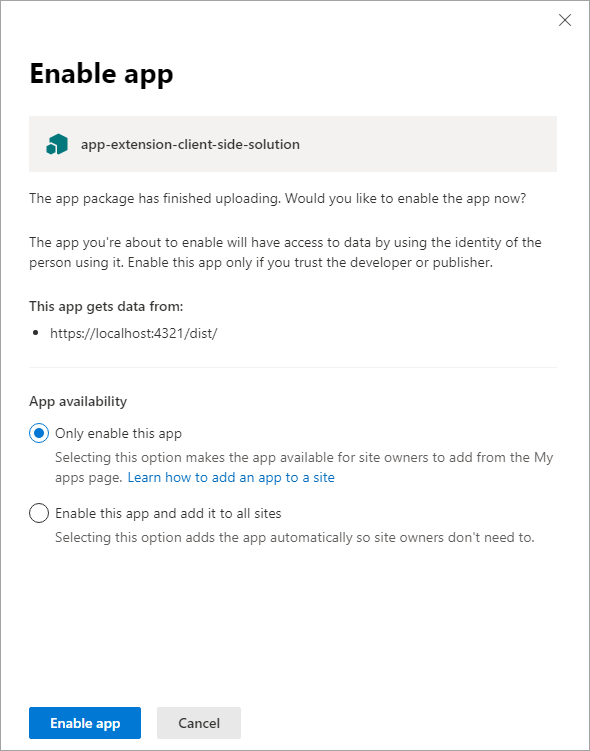
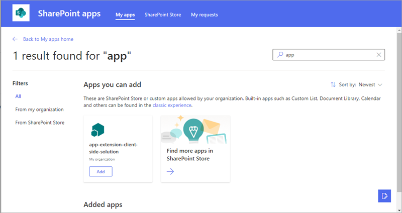

# Deploy your extension to SharePoint (Hello World part 3)

This article describes how to deploy your SharePoint Framework (SPFx) Application Customizer to SharePoint and see it working on modern SharePoint pages.

Be sure you've completed the procedures in the following articles before you begin:

- [Build your first SharePoint Framework Extension (Hello World part 1)](./build-a-hello-world-extension.md)
- [Use page placeholders from Application Customizer (Hello World part 2)](./using-page-placeholder-with-extensions.md)

You can also follow these steps by watching the video on the Microsoft 365 Platform Communtiy (PnP) YouTube Channel:

> [!Video https://www.youtube.com/embed/tReoZGtAYB4]

There are few different ways on getting your SPFx extensions deployed and activated in SharePoint sites. The correct option depends on your business requirements and objectives. The primary options are as follows:

- Activate the extension on specific site(s) using the Feature Framework-based activation option once the solution is installed. This is the only model that supports [site level assets getting created or deployed](/sharepoint/dev/spfx/toolchain/provision-sharepoint-assets) as part of the solution activation.
- Use the [tenant-scoped deployment option](/sharepoint/dev/spfx/tenant-scoped-deployment) and activate the extension on specific sites available SharePoint APIs and interfaces.
- Use the tenant-wide deployment option for extensions from app catalog. This capability was introduced in the SharePoint Framework v1.6.

## Package the Hello World Application Customizer

In this example, we'll activate the extension in a single site. This means that we'll use the Feature Framework-based activation when the solution is being installed on the site.

1. In the console window, go to the extension project directory created in [Build your first SharePoint Framework Extension (Hello World part 1)](./build-a-hello-world-extension.md).

    ```console
    cd app-extension
    ```

1. If gulp serve is still running, stop it from running by selecting <kbd>CTRL</kbd>+<kbd>C</kbd>.

    Unlike in **Debug** mode, to use an extension on modern SharePoint pages, you need to deploy and register the extension with SharePoint in **Site collection**, **Site**, or **List** scope. The scope defines where and how the Application Customizer is active. In this particular scenario, we'll register the Application Customizer by using the **Site collection** scope.

    Before we package our solution, we want to include the code needed to automate the extension activation when the solution is installed on the site. In this case, we'll use Feature Framework elements to do these actions in the solution package, but you could also associate the Application Customizer to a SharePoint site by using the SharePoint REST or CSOM APIs as part of the site provisioning.

1. Install the solution package to the site where it should be installed so that the extension manifest allowed for execution.
1. Associate the Application Customizer to the planned scope. This can be done programmatically via the SharePoint REST or CSOM APIs, or by using the Feature Framework in the SharePoint Framework solution package. You need to associate the following properties in the `UserCustomAction` object at the site collection, site, or list level.

    - **ClientSideComponentId**: This is the identifier (GUID) of the SPFx extension that has been installed in the app catalog.
    - **ClientSideComponentProperties**: This is an optional parameter that can be used to provide properties for the SPFx extension instance.

    You can control the requirement to add a solution containing your extension to the site with the `skipFeatureDeployment` setting in the **./config/package-solution.json** file. Even though you wouldn't require the solution to be installed on the site, you need to associate `ClientSideComponentId` to specific objects for the extension to be visible.

### Review the existing elements.xml file for SharePoint definitions

In the following steps, we'll review the `CustomAction` definition, which was automatically created for the solution as part of the scaffolding for enabling the solution on a site when it's installed.

1. Return to your solution package in Visual Studio Code (or to your preferred editor).
1. Open the **./sharepoint/assets/elements.xml** file.

   

Review the existing XML structure in the **elements.xml** file. The `ClientSideComponentId` property was updated based on the unique ID of your Application Customizer defined in the **./src/extensions/helloWorld/HelloWorldApplicationCustomizer.manifest.json** file.

The `ClientSideComponentProperties` property is set to the default structure and JSON properties for our extension. Notice the JSON is escaped so that it can be set within an XML attribute.

The configuration uses the specific location of `ClientSideExtension.ApplicationCustomizer` to define that this is an Application Customizer. Because this **elements.xml** is associated to a `Web` scoped feature by default, this `CustomAction` is automatically added to the `Web.UserCustomAction` property in the site where the solution is being installed.

Ensure that the configuration matches the changes made to the properties of the Application Customizer. Set the `ClientSideComponentProperties` property to the following HTML encoded JSON string that contains the property values:

```xml
{&quot;Top&quot;:&quot;Top area of the page&quot;,&quot;Bottom&quot;:&quot;Bottom area in the page&quot;}
```

### What about ClientSideInstance.xml file in assets folder?

**ClientSideInstance.xml** file is used with [Tenant Wide deployment of SharePoint Framework extensions](../basics/tenant-wide-deployment-extensions.md). You can use this file to add an entry to the centralized **Tenant-Wide Extensions** list in the tenant app catalog site if you use the tenant-scoped deployment option. In this tutorial, we selected the solution to be installed at the site level, which means that this file will be ignored when solution is activated in the app catalog.

**Tenant-Wide Extensions** list can be used to automatically activate extensions in tenant from a centralized location. Tenant-wide deployment is supported for Application customizers and list view command sets. You can specify different target definitions, like activation based on the site type or list type.

For this tutorial, we don't need this file as we'll be activating solution in a specific site using feature XML based provisioning.

> [!TIP]
> For more information, see: [Tenant-wide Deployment of SharePoint Framework Extensions](../basics/tenant-wide-deployment-extensions.md)

### Ensure that definitions are taken into account within the build pipeline

The **./config/package-solution.json** file defines the package metadata. To ensure that the **elements.xml** file is taken into account while the solution is being packaged, the default scaffolding includes the required configuration to define a Feature Framework feature definition in the solution package.

The original `elementManifests` property in the **./config/package-solution.json** file looks like this:

```json
"assets": {
  "elementManifests": [
    "elements.xml",
    "clientsideinstance.xml"
  ]
}
```

Remove the entry for **clientsideinstance.xml** under `elementManifests`, as we don't need that for this tutorial:

```json
"assets": {
  "elementManifests": [
    "elements.xml"
  ]
}
```

The **./config/package-solution.json** now looks similar to the following example after the required edits:

```json
{
  "$schema": "https://developer.microsoft.com/json-schemas/spfx-build/package-solution.schema.json",
  "solution": {
    "name": "app-extension-client-side-solution",
    "id": "65e15d73-515b-4d57-8c92-66ba5890c7b4",
    "version": "1.0.0.0",
    "includeClientSideAssets": true,
    "skipFeatureDeployment": true,
    "isDomainIsolated": false,
    "developer": {
      "name": "",
      "websiteUrl": "",
      "privacyUrl": "",
      "termsOfUseUrl": "",
      "mpnId": "Undefined-1.14.0"
    },
    "metadata": {
      "shortDescription": {
        "default": "app-extension description"
      },
      "longDescription": {
        "default": "app-extension description"
      },
      "screenshotPaths": [],
      "videoUrl": "",
      "categories": []
    },
    "features": [
      {
        "title": "Application Extension - Deployment of custom action",
        "description": "Deploys a custom action with ClientSideComponentId association",
        "id": "41b490c7-49f7-4db4-b7ea-c632d0fb9785",
        "version": "1.0.0.0",
        "assets": {
          "elementManifests": [
            "elements.xml"
          ]
        }
      }
    ]
  },
  "paths": {
    "zippedPackage": "solution/app-extension.sppkg"
  }
}
```

## Deploy the extension to SharePoint Online and host JavaScript from local host

Now you're ready to deploy the solution to a SharePoint site and have the `CustomAction` associated on the site level.

1. In the console window, enter the following command to package your client-side solution that contains the extension so that we get the basic structure ready for packaging:

   ```console
   gulp bundle
   ```

1. Execute the following command so that the solution package is created:

   ```console
   gulp package-solution
   ```

   This command creates the following package: **./sharepoint/solution/app-extension.sppkg**.

1. You now need to deploy the package to the app catalog. Go to your tenant's **app catalog** and upload or drag and drop the **./sharepoint/solution/app-extension.sppkg** file into the **Apps for SharePoint** list. SharePoint displays a panel that asks you to enable the client-side solution.

   We did not update the URLs for hosting the solution for this deployment, so the URL is still pointing to **https://localhost:4321**.

1. Select the **Only enable this app** radio button and then select the **Enable app** button.

   

1. Go back to your console and ensure that the solution is running. If it's not running, execute the following command in the solution folder:

   ```console
   gulp serve --nobrowser
   ```

1. Go to the site where you want to test SharePoint asset provisioning. This could be any site collection in the tenant where you deployed this solution package.
1. Select the gear icon on the top navigation bar on the right, and then select **Add an app** to go to your Apps page.
1. In the **Search** box, enter **app**, and then select <kbd>ENTER</kbd> to filter your apps.

    

1. Select the **app-extension-client-side-solution** app to install the solution on the site. When the installation is completed, navigate back to the site where you installed the app.

    You can now see the header and footer being rendered just like with the debug query parameters.

    

## Next steps

Congratulations, you've deployed an extension to a modern SharePoint page from the app catalog!

You can continue building out your Hello World extension in the next topic, [Host extension from Office 365 CDN (Hello World part 4)](./hosting-extension-from-office365-cdn.md), where you learn how to deploy and load the extension assets from a CDN instead of from localhost.
