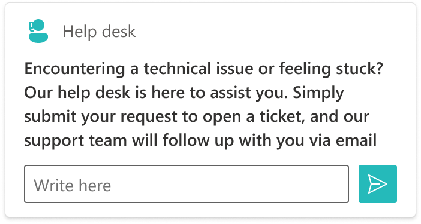

# SharePoint Framework v1.18 release notes

This release focuses on new features within the Viva Connections side and evolving existing capabilities within the other areas on building Microsoft 365 solutions with SharePoint Framework.

**Released:** September 12, 2023

[!INCLUDE [spfx-release-notes-common](../../includes/snippets/spfx-release-notes-common.md)]

## Install the latest version

Install the latest official release of the SharePoint Framework (SPFx) by using the **@latest** tag

```console
npm install @microsoft/generator-sharepoint@latest --global
```

## Upgrading projects from v1.17 to v1.18

In the project's **package.json** file, identify all SPFx v1.17.x packages. For each SPFx package:

1. Uninstall the existing v1.17.x package:

    ```console
    npm uninstall @microsoft/{spfx-package-name}@1.17.x
    ```

1. Install the new v1.18 package:

    ```console
    npm install @microsoft/{spfx-package-name}@latest --save --save-exact
    ```

[!INCLUDE [spfx-release-upgrade-tip](../../includes/snippets/spfx-release-upgrade-tip.md)]

## New features and capabilities

Related updated documentation for the 1.18 release:

* [Designing Viva Connections custom cards for your dashboard](./viva/design//designing-card.md)
* [Migrate Adaptive Card Extensions to SharePoint Framework 1.18](./viva/get-started/migrate-to-spfx-1-18.md)
* [Tutorial - Create a People Search Adaptive Card Extension](./viva/get-started//build-people-search-adaptive-card-extension.md)

New samples showcasing the new Viva Connections features:

* [Start a Chat Text Box input Adaptive Card Extension](https://github.com/pnp/sp-dev-fx-aces/tree/main/samples/InputCard-Start-Chat)
* [Prompt Survey Adaptive Card Extension](https://github.com/pnp/sp-dev-fx-aces/tree/main/samples/InputCard-Prompt-Survey)
* [People Search Adaptive Card Extension](https://github.com/pnp/sp-dev-fx-aces/tree/main/samples/InputCard-PeopleSearch)

Video in YouTube showcasing the new template options for Viva Connections

* [Introduction to new features and capabilities within SPFx 1.18](https://www.youtube.com/watch?v=LJAUVd4leRY)
* [Introducing new Microsoft Viva Connection card layouts in the SharePoint Framework 1.18](https://www.youtube.com/watch?v=S5KCV3ZiAAI)

### NodeJS v18 support

SharePoint Framework solutions now support NodeJS v18 as the default version.

### Support for Execute Action in Adaptive Card Extensions

Developers can use `Execute` action for both card view and quick view actions.

### BaseComponentsCardView as a new default card view for Adaptive Card Extensions

We introduce new default class for Adaptive Card Extensions card views. With these new class developers can specify a set of components that is rendered in a card view.

For more information on the new designs, see [Designing Viva Connections custom cards for your dashboard](./viva/design/designing-card.md).

```typescript
export abstract class BaseComponentsCardView<TProperties = {}, TState = {}, TParameters extends ComponentsCardViewParameters = ITextCardViewParameters> extends BaseCardView<TProperties, TState> {
    abstract get cardViewParameters(): TParameters;
}
```

Example usage:

```typescript
export class CardView extends BaseComponentsCardView<
  IHelloWorldAdaptiveCardExtensionProps,
  IHelloWorldAdaptiveCardExtensionState,
  ComponentsCardViewParameters
  > {
  public get cardViewParameters(): ComponentsCardViewParameters {

    return BasicCardView({
      cardBar: {
        componentName: 'cardBar',
        title: this.properties.title,
        icon: {
          url: this.properties.iconProperty
        }
      },
      header: {
        componentName: 'text',
        text: 'Hello world!'
      },
      footer: {
        componentName: 'cardButton',
        title: 'Quick View',
        action: {
          type: 'QuickView',
          parameters: {
            view: QUICK_VIEW_REGISTRY_ID,
          },
        },
      },
    });
  }
}
```

### Adaptive Card Extensions flexible card views

With this release, we introduce more flexible way to configure card views for Adaptive Card Extensions. Developers can now "mix and match" components in a card view configuration based on allowed set of [variations](./viva/design/designing-card.md).

Use new **Generic Card Template** in the generator to get started. Migration guide for existing projects is available [here](./viva/get-started/migrate-to-spfx-1-18.md).

### Ability to use text input in Adaptive Card Extensions' card views

Developers can now use text input component in a body or footer of a card view. For more information on the layout options, see [Designing Viva Connections custom cards for your dashboard](./viva/design/designing-card.md).

> [!NOTE]
> The text input component is fully supported in the browser and in Teams desktop. Full support for Viva Connections mobile will be enabled later.




### New Search Card Template for Adaptive Card Extensions

We introduce a new search card view for Adaptive Card Extensions that is intended to be used for search scenarios. Use new **Search Card Template** in the generator to get started.

> [!NOTE]
> The text input component is fully supported in the browser and in Teams desktop. Full support for Viva Connections mobile will be enabled later.


### Support onChange event for ACE TextInput and SearchBox

Developers can now use onChange event for TextInput and SearchBox components in Adaptive Card Extensions.

```typescript
/**
 * Text change event handler.
 */
onChange?: (newValue?: string) => void;
```
> [!NOTE]
> The `onChange` event for TextInput and SearchBox is fully supported in the browser and in Teams desktop. Full support for Viva Connections mobile will be enabled later.

### Ability to detect host's theme for Viva Connections Mobile

Starting with this version, developers have access to `hostContext` in the `AdaptiveCardExtensionContext` object. This property allows to detect host's theme.
```typescript

export type HostTheme = 'light' | 'dark' | undefined;

export interface IHostContext {
  /**
 *
 * theme is used to define what the the current colour scheme for the VCM app. It has currently 2 values
      light: If VCM is in light mode, we use the theme 'light',
      dark: If VCM is in dark mode, we use the theme 'dark'
 */
  theme: HostTheme;
}
```

### Fluent UI React v8 support

Starting from this version, React templates use Fluent UI React v8 instead of v7.

### Transparent outline icon for Teams-hosted web parts

The default outline icon for Microsoft Teams hosted web parts is now transparent. This ensures that the default icon meets the Microsoft Teams design requirements for application.

### TypeScript v4.7 Support

SPFx solutions now support TypeScript v4.7.

> [!NOTE]
> A developer needs to manually set NODE_OPTIONS environment variable to `--openssl-legacy-provider` to use NodeJS v18 after the NodeJS 18 has been installed. This requirement is intended to be removed with the General Availability version of the 1.18. This setting is required to adjust the toolchain to work properly with Webpack 4 which the SPFx tooling is using for now.
> This can be done using `export NODE_OPTIONS=--openssl-legacy-provider` on Mac/Linux or `set NODE_OPTIONS=--openssl-legacy-provider` on Windows.

## Deprecations

- `BaseAdaptiveCardView` - use `BaseAdaptiveCardQuickView` instead
- `template` property in `BaseTemplateCardView` and its descendants

## Fixed Issues

- [#9010](https://github.com/SharePoint/sp-dev-docs/issues/9010) - Placeholder `{tenantDomain}` isn't replaced with `SPFX_SERVE_TENANT_DOMAIN`.

## Feedback and issues

We're interested on your feedback around the release. Do let us know any findings or other feedback using the [SPFx issue list](https://github.com/SharePoint/sp-dev-docs/issues).

Happy coding! Sharing is caring! 🧡
