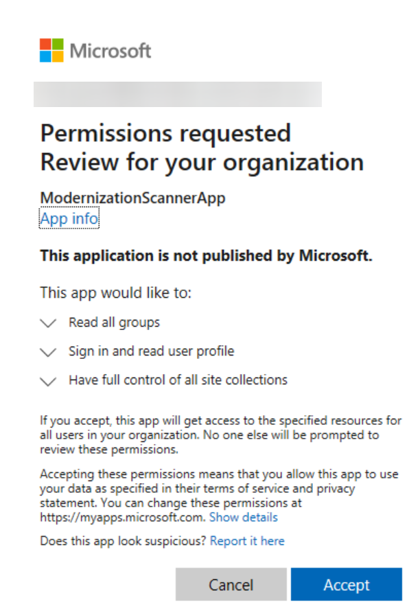
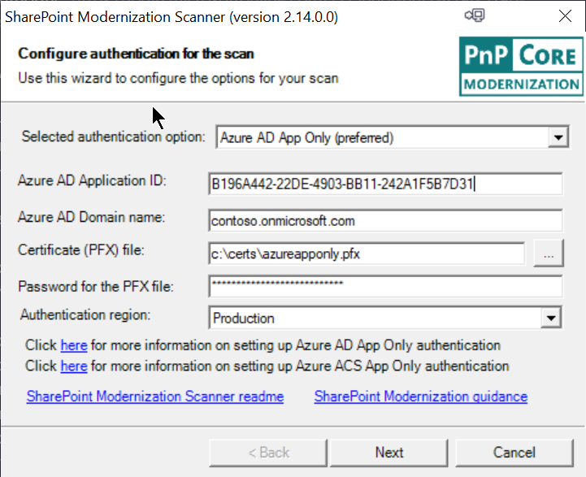
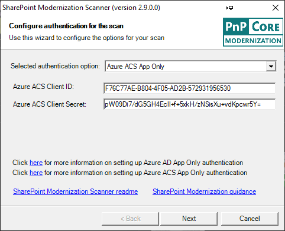
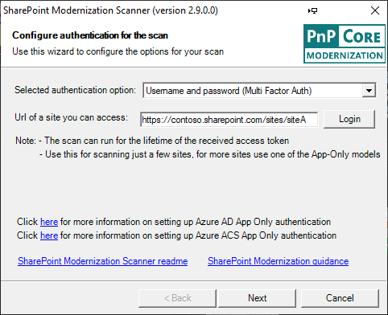
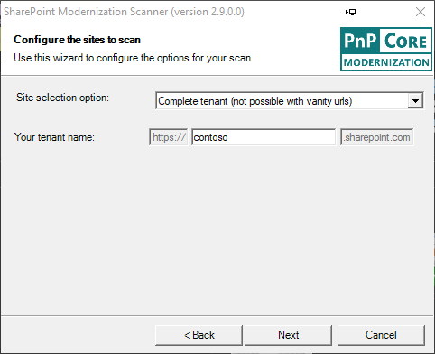
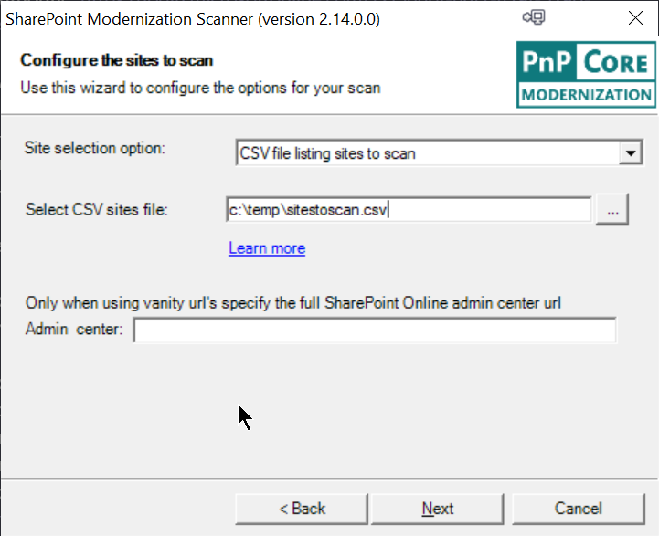
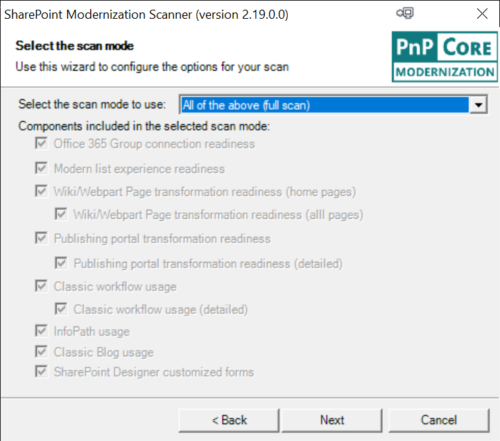
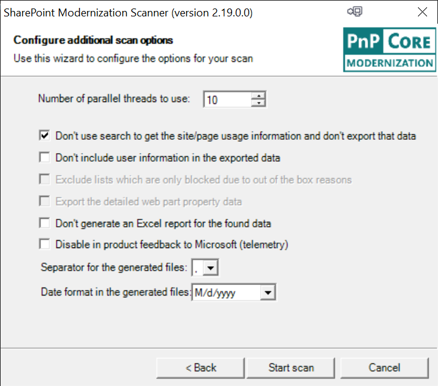

# Getting started with the SharePoint modernization scanner

Using the SharePoint Modernization scanner you can prepare your classic sites for modernization. The scanner will help you prepare for the following modernization efforts:

- Optimizing the usage of modern list and libraries
- Connecting these sites to a Microsoft 365 group
- Modernizing the wiki and web part pages by creating modern site pages
- Rebuilding classic publishing portals as modern publishing portals
- Understanding where classic workflow is used
- Understanding where InfoPath is being used
- Understanding the usage of classic blog pages

This scanner is a key tool to use if you want to prepare for modernizing your classic sites as it will give you factual data about how easy it is to modernize your sites. Using the dashboards generated by the scanner you'll be able to drill down on the "modernization readiness" of your sites and plan the needed remediation work where needed.

> [!NOTE]
> The SharePoint modernization scanner only is supported for running against SharePoint Online. For scanning on-premises SharePoint you can consider using the [SharePoint Migration Assessment Tool](https://docs.microsoft.com/sharepointmigration/overview-of-the-sharepoint-migration-assessment-tool) (SMAT).
>
> [!IMPORTANT]
> Modernization tooling and all other PnP components are open-source tools backed by an active community providing support for them. There is no SLA for open-source tool support from official Microsoft support channels.

## Step 1: Get the latest version of the SharePoint modernization scanner

Since SharePoint Online continuously evolves and more and more modern capabilities are added, it's important to always download the latest version of the scanner. [Download the SharePoint Modernization Scanner executable](https://github.com/SharePoint/sp-dev-modernization/blob/dev/Tools/SharePoint.Modernization/Releases/SharePoint.Modernization.Scanner.exe?raw=true) and get started. This page and the other pages linked to it contain all information to get you started, and also all the report details and an FAQ.

## Step 2: Preparing for a scan

Since a typical scan needs to be able to scan all site collections, it's recommended to use an app-only principal with tenant scoped permissions for the scan. This approach will ensure the scanner always has access, if you use an account (for example, your SharePoint tenant admin account) then the scanner can only access the sites where this user also has access. You can either use an Azure AD application or a SharePoint app principal for app-only access and below links describe the manual approach to setting up things. As the recommended approach is Azure AD App-Only, you can easy the setup of your Azure AD application by using the [PnP PowerShell](https://aka.ms/pnppowershell) `Initialize-PnPPowerShellAuthentication` cmdlet. See the **Using Initialize-PnPPowerShellAuthentication to setup Azure AD App-Only** chapter for more details.

- [Granting access via Azure AD App-Only (recommended)](../solution-guidance/security-apponly-azuread.md)
- [Granting access via SharePoint App-Only](../solution-guidance/security-apponly-azureacs.md)

> [!IMPORTANT]
> If you're choosing for Azure AD app-only, then above mentioned instructions grant the Azure AD app the **Sites.FullControl.All** permission, which is needed if you want to run **all** scan components.
> If you're not interested in workflow scanning you can also use **Sites.Read.All** as a permission (as of version 2.6).
> If you want to report on site collections that have a Teams team linked then you also need to add the **Group.Read.All** permission (as of version 2.7).

Once the preparation work is done, let's continue with doing a scan.

### Using Initialize-PnPPowerShellAuthentication to setup Azure AD App-Only

To configure Azure AD App-Only using PnP PowerShell follow these steps:

1. Install [PnP PowerShell](https://aka.ms/pnppowershell) or update it to the April 2020 or a more recent version
2. Use the `Initialize-PnPPowerShellAuthentication` cmdet to setup an Azure AD app:

```PowerShell
Initialize-PnPPowerShellAuthentication -ApplicationName ModernizationScannerApp -Tenant contoso.onmicrosoft.com -Scopes "SPO.Sites.FullControl.All","MSGraph.Group.Read.All"  -OutPath c:\temp -CertificatePassword (ConvertTo-SecureString -String "password" -AsPlainText -Force)
```

3. You'll be asked to authenticate, ensure you authenticate with a user that is a tenant administrator
4. The cmdlet will setup an Azure AD app and wait for 60 seconds to give Azure AD time to handle the App creation
5. You'll be asked to consent the permissions granted to the created Azure AD application:
   1. First you'll be asked to login again, use a tenant administrator account
   2. Next the consent dialog is shown with the requested permissions (see screenshot below). Click **Accept**
6. Store the returned AzureAppId, created PFX file and password somewhere safe, you'll need to use it as described in below chapter **Authenticate via Azure AD app-only**



## Step 3: Launch a scan using the user interface option

The easiest approach is to simply launch SharePoint.Modernization.Scanner.exe as the scanner does have a UI. Alternatively you can start a (PowerShell) command prompt and navigate to that folder so that you can use the scanner via command line. This chapter will walk you through the UI option taking a typical **full** scan. Start by launching the SharePoint.Modernization.Scanner.exe.

### Page 1: Scanner authentication configuration

#### Authenticate via Azure AD app-only

The first page of the modernization scanner wizard asks you for authentication information. The scanner supports four options, select the one you need and fill in the needed information as described below. Ideally you use an app-only model as that will ensure the scanner has access to all sites it needs to scan.



If you've [setup access via Azure AD App-Only](../solution-guidance/security-apponly-azuread.md), you do have created an Azure App and configured a certificate for accessing it. This information needs to be provided to the tool:

- **Azure AD Application ID**: ID of the created application in your Azure AD environment
- **Azure AD Domain name**: the default domain of your Azure AD environment. You can find this from the overview page of the Azure AD admin center. Typically this domain is formatted as *.onmicrosoft.com, for example, contoso.onmicrosoft.com.
- **Certificate file**: the certificate that you granted app-only access to the Azure AD app, this needs to be presented as a password protected PFX file
- **Password for the PFX file**: the password used to secure the previously provided PFX file
- **Authentication region**: if your tenant is located in the US Government (ITAR), Germany or China cloud environment then select the respective region

> [!NOTE]
> You can also opt to install the certificate on your computer and reference it via the -w command line parameters. To reference the certificate you would use this value for the -w parameter "My|CurrentUser|1FG498B468AV3895E7659C8A6F098FB701C8CDB1". You can use My/Root and CurrentUser/LocalMachine to identify the store. The last argument is the certificate thumbprint. This option is available as of the 2.7 release. If you're using LocalMachine then be aware that you'll need to ensure the scanner has permissions to read in the LocalMachine store. You can do this by either running the scanner process under administrative privileges or alternatively (and better) grant the account you're using to run the modernization scan permissions to read the private key of the certificate stored in the LocalMachine store.

> [!IMPORTANT]
> - The default instructions mentioned to grant the Azure AD app the **Sites.FullControl.All** permission which is needed if you want to run all scan components. If you're not interested in workflow scanning you can also use **Sites.Read.All** as a permission as of version 2.6 of the SharePoint Modernization Scanner.
> - Azure AD App-Only is the only supported authentication option for tenants in the US Government (ITAR), Germany or China cloud environment.

#### Authenticate via SharePoint AD app-only



In case you used the "classic" [SharePoint App-Only](../solution-guidance/security-apponly-azureacs.md) approach then you need to specify:

- **Azure ACS Client ID**: the ID of the created app-only principal
- **Azure ACS Client Secret**: the secret that you got when you created the app principal

#### Authenticate via credentials


Using a regular user/password combo works fine as well, assuming the provided user does have the needed permissions. As of version 2.9 of the scanner the user/password based authentication does not rely anymore of legacy auth being enabled on the scanned tenant. The only reason why this type of authentication would not work is when the used account requires multi-factor authentication. If that's the case then please use the Multi Factor Auth option introduced as of version 2.9.

#### Authenticate via Multi Factor Authentication (as of version 2.9)



Depending on the tenant and account you're using your admin might require multi-factor authentication for logging into to SharePoint Online. If that's the case you'll need to use this option if you want to use the scanner via user credentials. Using an app-only approach is still recommended, but if you do not have the needed permissions for setting up app-only this approach will allow you to scan the site collections you as a user have permissions for. To use this you'll need to:

- Enter the URL of a site you want to scan (any site you've access to will be fine)
- Click on the **Login** button which will trigger the multi factor authentication flow

> [!NOTE]
> The multi factor authentication will give the scanner an access token after you've successfully logged on. Since an access token has limited lifetime (typically 1 hour) this means that scan will only be able to access SharePoint sites while the token is still valid.

### Page 2: Scanner site scope configuration

#### Scan full tenant

This page allows you to define which sites are being scanned. The scanner supports scanning the full tenant up to individually selected site collections.



Scanning the complete tenant is often the recommended approach as that will give you modernization reports for all. If that's your choice, then simply fill your tenant name. This approach doesn't work if your tenant is **using URLs that do not end on sharepoint.com**, if that's the case you need to use one of the two below options.

#### Scan a defined list of site collections


This option makes it possible to select one or more site collections by either providing

- **The fully qualified URL** of the site collection(s) that need need(s) to be scanned
- **A wildcard URL**: by adding a URL that ends with a star, you'll include all sites that match that filter. Only ending on an star is a supported wildcard

If you're using URLs that do not end on sharepoint.com (so called vanity URLs), you'll also need to specify the URL of your tenant admin center site (for example, https://contoso-admin.contoso.com).

#### Scan a list of site collections defined in a CSV file



As a third option you can provide the scanner with a CSV file listing the site collections to scan. This CSV file is a simple list of site collections, the file doesn't have a header as shown in this sample:

```text
https://contoso.sharepoint.com/sites/hrteam
https://contoso.sharepoint.com/sites/funatwork
https://contoso.sharepoint.com/sites/opensourcerocks
```

### Page 3: Scanner mode configuration

The SharePoint modernization scanner does support multiple modes, depending on your modernization mode you might want to scope the scan to a certain area or alternatively, execute a full scan.



Select the option you want in the dropdown and then the checkboxes will show which components will be included in the scan. The "Microsoft 365 group connection readiness" component is the main component that will be included all scan modes.

### Page 4: Scanner options

As a last step you can tweak the scanner options. Depending on the earlier chosen scanner mode, some options might be disabled.



Following scan options are available:

- **Number of threads**: the scan is multi-threaded, default is 10 but for larger scans 20-30 threads delivers a better scan performance (your mileage might vary)
- **Don't use search**: if you're interested in page/site usage information then you can unselect this option. As this adds one search query per site collection, it will make the scan slightly slower
- **Don't include user information**: check this box if you're not interested in seeing user information (user names) as part of the produced data
- **Exclude lists**: For the "Modern list and library experience" scan you can exclude lists that are only blocked due to an OOB reason
- **Export page details**: By default the scan isn't exporting detailed web part information (web part properties) as that dataset can be huge. Check this box if you would like to have the full web part option data
- **Don't generate reports**: by default you get Excel-based dashboards as scan output, but you can skip these if you're only interested in the raw CSV files
- **Disable feedback**: the scanner will send feedback to Microsoft to help improve the scanner. If you don't like that, then feel free to check this box
- **Separator**: the default separator for the generated CSV files is a comma, but you can change this to semi-colon if you would prefer that
- **Date format**: the default date format in the generated CSV files is month/day/year. You can optionally switch this to day/month/year

## Step 3 (alternative option): Launch a scan using command line

Below option is the default usage of the tool for most customers: you specify the mode, your tenant name, and the created client id and secret:

```console
SharePoint.Modernization.Scanner.exe -t <tenant> -i <clientid> -s <clientsecret>
```

A real life sample:

```console
SharePoint.Modernization.Scanner.exe -t contoso -i 7a5c1615-997a-4059-a784-db2245ec7cc1 -s eOb6h+s805O/V3DOpd0dalec33Q6ShrHlSKkSra1FFw=
```

The above use will run all scanning options, but you can also target the scan via the `Mode` parameter (-m):

```console
SharePoint.Modernization.Scanner.exe -m <mode> -t <tenant> -i <clientid> -s <clientsecret>
```

A real life sample:

```console
SharePoint.Modernization.Scanner.exe -m GroupifyOnly -t contoso -i 7a5c1615-997a-4059-a784-db2245ec7cc1 -s eOb6h+s805O/V3DOpd0dalec33Q6ShrHlSKkSra1FFw=
```

### Supported scanner modes

Mode                      | Description
------------------------- | -----------------------------------------------------------------------------------------------------------------------------------
`Full`                    | All components will be included, omitting -m has the same result
`GroupifyOnly`            | Only use the Microsoft 365 group connection readiness component, this component is part of each scan
`ListOnly`                | Includes a deep list scan + includes the Microsoft 365 group connection readiness component
`HomePageOnly`            | Includes a scan from wiki and web part pages home pages + includes the Microsoft 365 group connection readiness component
`PageOnly`                | Includes a scan from wiki and web part pages + includes the Microsoft 365 group connection readiness component
`PublishingOnly`          | Includes a classic publishing portal scan at site and web level + includes the Microsoft 365 group connection readiness component
`PublishingWithPagesOnly` | Includes a classic publishing portal scan at site, web and page level + includes the Microsoft 365 group connection readiness component
`WorkflowOnly`            | Includes the classic workflow scan + includes the Microsoft 365 group connection readiness component
`WorkflowWithDetailsOnly` | Includes the classic workflow scan with workflow migration readiness analysis + includes the Microsoft 365 group connection readiness component
`InfoPathOnly`            | Includes the InfoPath scan + includes the Microsoft 365 group connection readiness component
`BlogOnly`                | Includes the Blog scan + includes the Microsoft 365 group connection readiness component
`CustomizedFormsOnly`     | Includes the Customized Forms scan + includes the Microsoft 365 group connection readiness component

### Command-line parameter overview

```text
SharePoint PnP Modernization scanner 2.19.0.0
Copyright (C) 2020 SharePoint PnP
==========================================================

See the sp-dev-modernization repo for more information at:
https://github.com/SharePoint/sp-dev-modernization/tree/master/Tools/SharePoint.Modernization

Let the tool figure out your urls (works only for SPO MT):
==========================================================
Using Azure AD app-only:
SharePoint.Modernization.Scanner.exe -t <tenant> -i <your client id> -z <Azure AD domain> -f <PFX file> -x <PFX file
password>
e.g. SharePoint.Modernization.Scanner.exe -t contoso -i e5808e8b-6119-44a9-b9d8-9003db04a882 -z conto.onmicrosoft.com
-f apponlycert.pfx -x pwd

Using app-only:
SharePoint.Modernization.Scanner.exe -t <tenant> -i <your client id> -s <your client secret>
e.g. SharePoint.Modernization.Scanner.exe -t contoso -i 7a5c1615-997a-4059-a784-db2245ec7cc1 -s
eOb6h+s805O/V3DOpd0dalec33Q6ShrHlSKkSra1FFw=

Using credentials:
SharePoint.Modernization.Scanner.exe -t <tenant> -u <your user id> -p <your user password>

e.g. SharePoint.Modernization.Scanner.exe -t contoso -u spadmin@contoso.onmicrosoft.com -p pwd

Specifying url to your sites and tenant admin (needed for SPO with vanity urls):
================================================================================
Using Azure AD app-only:
SharePoint.Modernization.Scanner.exe -r <wildcard urls> -a <tenant admin site>  -i <your client id> -z <Azure AD
domain> -f <PFX file> -x <PFX file password>
e.g. SharePoint.Modernization.Scanner.exe -r "https://teams.contoso.com/sites/*,https://my.contoso.com/personal/*" -a
https://contoso-admin.contoso.com -i e5808e8b-6119-44a9-b9d8-9003db04a882 -z conto.onmicrosoft.com  -f apponlycert.pfx
-x pwd

Using app-only:
SharePoint.Modernization.Scanner.exe -r <wildcard urls> -a <tenant admin site> -i <your client id> -s <your client
secret>
e.g. SharePoint.Modernization.Scanner.exe -r "https://teams.contoso.com/sites/*,https://my.contoso.com/personal/*" -a
https://contoso-admin.contoso.com -i 7a5c1615-997a-4059-a784-db2245ec7cc1 -s
eOb6h+s805O/V3DOpd0dalec33Q6ShrHlSKkSra1FFw=

Using credentials:
SharePoint.Modernization.Scanner.exe -r <wildcard urls> -a <tenant admin site> -u <your user id> -p <your user
password>
e.g. SharePoint.Modernization.Scanner.exe -r "https://teams.contoso.com/sites/*,https://my.contoso.com/personal/*" -a
https://contoso-admin.contoso.com -u spadmin@contoso.com -p pwd


  -i, --clientid                           Client ID of the app-only principal used to scan your site collections

  -s, --clientsecret                       Client Secret of the app-only principal used to scan your site collections

  -u, --user                               User id used to scan/enumerate your site collections

  -p, --password                           Password of the user used to scan/enumerate your site collections

  -z, --azuretenant                        Azure tenant (e.g. contoso.microsoftonline.com)

  -y, --azureenvironment                   (Default: Production) Azure environment (only works for Azure AD Cert
                                           auth!). Possible values: Production, USGovernment, Germany, China

  -f, --certificatepfx                     Path + name of the pfx file holding the certificate to authenticate

  -x, --certificatepfxpassword             Password of the pfx file holding the certificate to authenticate

  -a, --tenantadminsite                    Url to your tenant admin site (e.g. https://contoso-admin.contoso.com): only
                                           needed when your not using SPO MT

  -t, --tenant                             Tenant name, e.g. contoso when your sites are under
                                           https://contoso.sharepoint.com/sites. This is the recommended model for
                                           SharePoint Online MT as this way all site collections will be scanned

  -r, --urls                               List of (wildcard) urls (e.g.
                                           https://contoso.sharepoint.com/*,https://contoso-my.sharepoint.com,https://co
                                           ntoso-my.sharepoint.com/personal/*) that you want to get scanned. Ignored if
                                           -t or --tenant are provided.

  -o, --includeod4b                        (Default: False) Include OD4B sites in the scan

  -v, --csvfile                            CSV file name (e.g. input.csv) which contains the list of site collection
                                           urls that you want to scan

  -h, --threads                            (Default: 10) Number of parallel threads, maximum = 100

  -e, --separator                          (Default: ,) Separator used in output CSV files (e.g. ";")

  -m, --mode                               (Default: Full) Execution mode. Use following modes: Full, GroupifyOnly,
                                           ListOnly, PageOnly, HomePageOnly, PublishingOnly, PublishingWithPagesOnly,
                                           WorkflowOnly, WorkflowWithDetailsOnly, InfoPathOnly, BlogOnly or CustomizedFormsOnly. Omit or use
                                           full for a full scan

  -b, --exportwebpartproperties            (Default: False) Export the web part property data

  -c, --skipusageinformation               (Default: False) Don't use search to get the site/page usage information and
                                           don't export that data

  -j, --skipuserinformation                (Default: False) Don't include user information in the exported data

  -k, --skiplistsonlyblockedbyoobreaons    (Default: False) Exclude lists which are blocked due to out of the box
                                           reasons: base template, view type of field type

  -d, --skipreport                         (Default: False) Don't generate an Excel report for the found data

  -g, --exportpaths                        List of paths (e.g. c:\temp\636529695601669598,c:\temp\636529695601656430)
                                           containing scan results you want to add to the report

  -n, --disabletelemetry                   (Default: False) We use telemetry to make this a better tool...but you're
                                           free to disable that

  -q, --dateformat                         (Default: M/d/yyyy) Date format to use for date export in the CSV files. Use
                                           M/d/yyyy or d/M/yyyy

  -w, --storedcertificate                  (Default: ) Path to stored certificate in the form of
                                           StoreName|StoreLocation|Thumbprint. E.g.
                                           My|LocalMachine|3FG496B468BE3828E2359A8A6F092FB701C8CDB1

  --help                                   Display this help screen.
```
